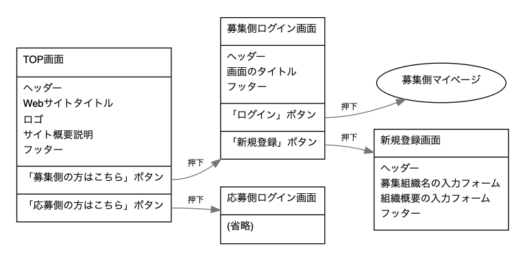

# ui-flows

---

## 前提

- UIフローとは何か
  - [実践UI Flows \- UI制作のはじまり｜UXマン｜note](https://note.mu/uxman/n/nbd21fec1ca29)
  - [brew install graphviz](https://github.com/hirokidaichi/uiflow)

- テキスト→画僧へのコンバート準備

  ```
  brew install graphviz
  npm install -g uiflow
  ```
- フォーマットサンプルのコンバート実行コマンド

  ```
  cd geranium/packages/document/design/front/ui-flows/
  bash ./make.sh
  ```

---

## UIフローを作ってもらう目的

- 各画面での
    - 各画面の前後関係
    - その画面で何を表示したいのか
    - その画面で何ができるのか
    - 考慮漏れしている画面の早期発見

---

## フォーマットサンプルは以下



- 上記の形式に合わせて、全画面のフローを洗い出していただきたく
  - 資料は、パワポでもPDFでも、何でも構いません
  - (とはいえ、紙切れや手書きの写真などよりかは、データとしていただきたい)

---

## 備考

- 作成していただいた資料を受け取った際には、
    - こちらにはコミットしません
    - privateリポジトリで別途管理します

