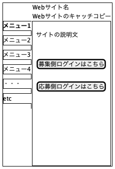

# wireframe

- [ワイヤーフレームとは何か？webサイト制作に重要なページ設計図を理解しよう！](https://nandemo-nobiru.com/web-5695)

- 上記参考サイトを各画面ごとに洗い出してもらいたい

## メモ: テキストベースで作るなら以下



```
cd geranium/packages/document/design/front/wireframe/
bash ./make.sh
```

