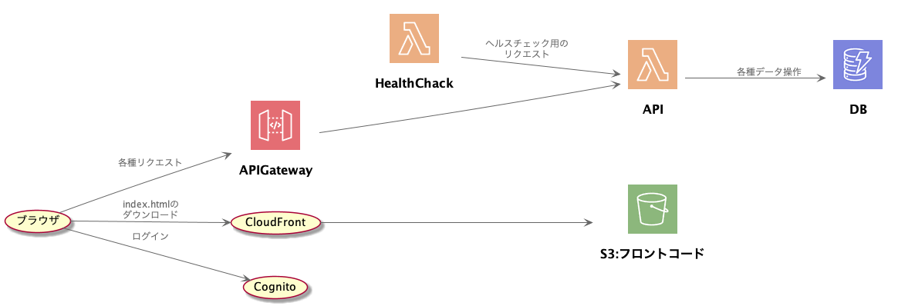

# aws-configuration

- awsの構成について

## コンバート

```
bash ./make.sh
```
## 構成図



## 参考

- [AWS Labs製のPlantUMLライブラリ『AWS Icons for PlantUML』の使い方 \- Qiita](https://qiita.com/0hm1/items/1b1e84ef1cc3dab5144d)

- [CloudFront \+ S3 \+ Cognito \+ AWS Amplify \+ Vue\.js で会員制サイトをサーバーレスで構築 \| ハックノート](https://hacknote.jp/archives/43397/)

- [AWS Labs製のPlantUMLライブラリ『AWS Icons for PlantUML』の使い方 \- Qiita](https://qiita.com/0hm1/items/1b1e84ef1cc3dab5144d)

- [awslabs/aws\-icons\-for\-plantuml: PlantUML sprites, macros, and other includes for Amazon Web Services services and resources](https://github.com/awslabs/aws-icons-for-plantuml)

